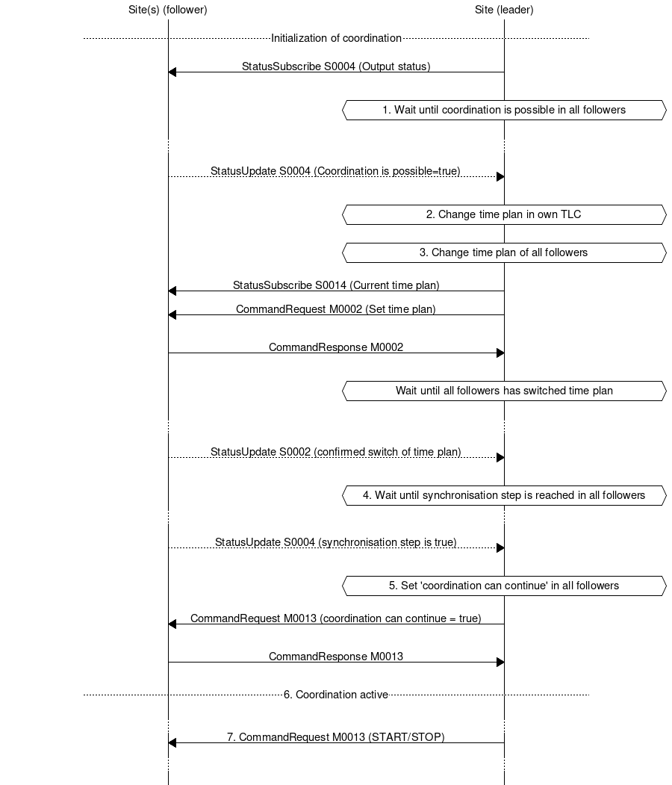
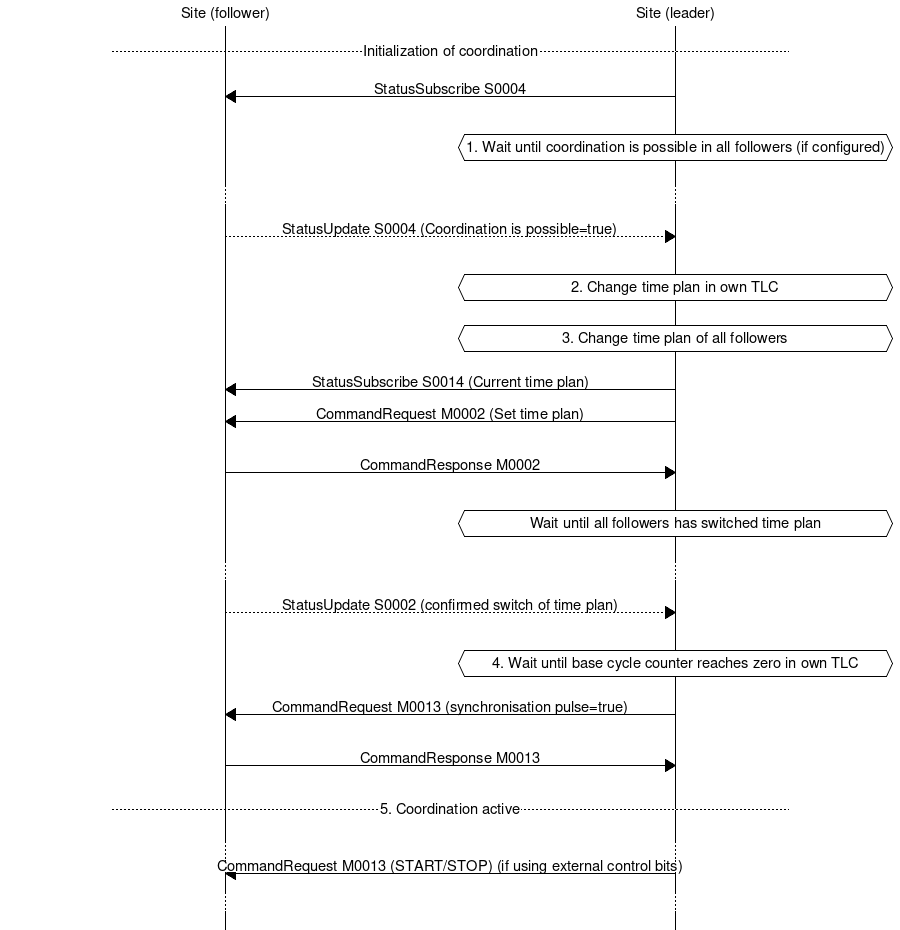

Appendix - coordination between traffic light controllers
=========================================================

General concepts
----------------
Coordination between Traffic Light Controllers (TLC) implies that several
intersections are controlled together in a coordinated control mode at
local or central level. Regardless of operational mode, prerequisites
are - among other things, that TLC:s must use the same time plan and must
be in synchronous operation. 

Local coordination can be applied in minor systems (up to 4
intersections). Control will in these systems be made with a common and
variable cycle depending on the traffic.

Central coordination can be applied in major systems (up to some 10
intersections or more). In central coordination a special master (M),
a combination of master/controller (M/C) or a system of cableless linking
is used. Within the system control bits should be sent according to in
advance designed time plans with selected and fixed cycle times for 
different traffic levels. In the individual intersection a certain
smaller degree of traffic adaption should be allowed, however, only
within the framework of the fixed and given cycle time.

The two coordination levels should be possible to combine. During peak
hours should e.g. the entire traffic signal area be coordinated at
central level while a split in locally coordinated sub areas should be
possible during normal off-peak hours. 


Coordination type "Local coordination"
--------------------------------------
Local coordination is achieved by supplementing the TLC:s control bits
of the signal groups with special control bits from signal group(s) in
another intersection.

This can be achieved with the following the following status modes:
- “Front edge of green wave”, which is normally sent when conflicting
  signal group in downstream traffic lights turns yellow
- “Rear edge of green wave”, which is normally sent when demand for
  green ends or yellow is sent to downstream TLC.

Front edge of green wave normally prevents signal groups in other TLC:s
to start and rear edge of green wave normally extends signal groups in
green, normally when demand for green ends, or yellow.  

Commands should be able to be sent from an optional change in signal
group status and should additionally be able to be supplemented with a
timer which initiates counts from these changes.

Variation in programming to achieve desired functionality according to
specifications may vary without having any impact on coordination
communication.

Coordination type "Central coordination"
----------------------------------------
Coordination type “Central coordination” should typically be possible to
operate in multiple time plans with optional signal group sequence split
and/or cycle time. 

The cycle time of the time plans should be possible to select in
increments of one second up to at least 180 seconds.

Signal group(s) should typically be able to have green 2 times per cycle.

Change between time plans should typically be possible to make at
optional points in the cycle, different in different time plans. Change
must not follow so that fixed times such as red/yellow, minimum green,
pedestrian green and green/yellow will be reduced or excluded.
Coordination should be achieved by exchanging the normal start bits
against special control bits which should be possible to send per one
second steps.

If control bits to the local TLC is missing for 120 seconds, the TLC
should automatically transfer to predetermined back up or safety mode.
If/when the control bits returns, the TLC should automatically return to
central coordination.

The control bits, arranged and time distributed within the framework of
the cycle of the time plan, should give the coordinated installation a
certain signal group sequence, split and offset between TLC'S. 
 
The control bits should be possible to use internally in a TLC or be
possible to send externally to another TLC which consequently also
should be able to receive externally incoming control bits. Together
with new control bits, the internal intelligence of the TLC should in
other respects be utilized normally, among other things, for
communication between the signal groups.

Coordination with control bits
------------------------------
**Coordination with internal control bits**

With internal control bits, only information about time plan/traffic
situation, initialization and clock sync needs to be sent and received.

**Coordination with external control bits**

In addition to the control bits in the previous paragraph, start bits
and stop bits must be sent and received. 

TLC:s should also be able to receive external start/stop bits. If the
active time plan is controlled by the other TLC, it must also be able
to receive subscription/request of e. g traffic data, detector logic
and signal groups status etc. 

General RSMP requirements
-------------------------
Communication must be established directly between TLC:s. This demands
the following general requirements:
- In every TLC, it must be possible to connect to other TLC:s and to
  receive connections from other TLC:s (client-server).
- The TLC must have a list with every connected and communicating TLC
  with editable communication parameters for each individual unit.
- The mentioned list above includes IP-addresses and signal exchange
  lists for every connected TLC. 
- The TLC must be configurable with signal exchange lists for every TLC
  that communication is intended with.  The signal exchange lists
  contain important information such as **siteId** and **component-id**
  which are needed to establish communication. Relevant parts of signal
  exchange lists must therefore be easily editable, in particular
  **siteId**, **component-id**, etc.
- The TLC must be able to communicate with the supervision system at the
  same as communicating between TLC:s.

Functional requirements of the TLC
----------------------------------
To establish coordination, it is required that both TLC:s use suitable
time plan/traffic situation and synchronize their cycle timers.

- It must be possible to configure TLC:s as leader/follower
- One leader TLC should be able to communicate with up to 20 follower
  TLC:s.

The following input/output is needed

Command types       | Description
--------------------|------------
M0002               | Time plan
M0006/M0013 (Input) | Coordination can continue (local coordination) (true/false)
M0006/M0013 (Input) | Synchronization pulse (coordination with continue) (true/false)
M0006/M0013 (Input) | START bit (true/false)
M0006/M0013 (Input) | STOP bit (true/false)


Status types   | Description
---------------|------------
S0004 (Output) | Coordination is possible (true/false)
S0004 (Output) | Synchronization step (local coordnation) (true/false)

Please note:
- securityCode is ignored at TLC-TLC-communication. Fields for
  securityCode still must be sent at communication exchange – but
  contents can be empty.
- M0010 (Start/Stop) also exists in SXL but is not used in coordination.

Notes about JSon
----------------
Every field must be present in every message at communication exchange
according to the signal exchange list. This applies even if the fields
are empty. In the example below ”securityCode” is included in a command
despite that ”securityCode” is ignored at TLC-TLC communication. The
field is empty for this reason.

```
{
	"mType": "rSMsg",
	"type": "CommandRequest",
	"mId": "E68A0010-C336-41ac-BD58-5C80A72C7092",
	"ntsOId": "",
	"xNId": "",
	"cId": "KK+AG9998=001TC000",
	"arg": [{
		"cCI": "M0002",
		"n": "status",
		"cO": "setPlan",
		"v": "True"
	},{
		"cCI": "M0002",
		"n": "securityCode",
		"cO": "setPlan",
		"v": ""
	},{
		"cCI": "M0002",
		"n": "timeplan",
		"cO": "setPlan",
		"v": "5"
	}]
}
```

Communication establishment
---------------------------
Follower TLC's acts server and waits for a leader TLC to connect.
Should communication fail, it is the responsibility of the leader
TLC to connect again.

When the leader TLC has connected, messages between the TLC's are
sent according the initialization sequence.

Communication is continuously established even if coordination is not
active.

The handshake sequence is defined in the RSMP specification, section [Communication establishment between sites](https://github.com/rsmp-nordic/rsmp_core/blob/master/rst/rsmp.rst#communication-establishment-between-sites)

Initialization sequence for local coordination
----------------------------------------------
1. Leader verifies that coordination is possible through subscription
   on output (S0004) _coordination is possible_ in all followers. If
   coordination isn't possible, coordination is terminated.
2. Leader switches to coordinated time plan in its own TLC.
3. Leader sends command to all followers to switch to coordinated time
   plan.
4. Leader waits at own synchronisation step until synchronisation
   step is active in all followers. Leader must subscribe to
   S0004 _Synchronisation step_ in all followers to verify this.
5. Leader activates input (S0013) _coordination can continue_
   in all followers about continued coordination.
6. Leader continuously checks that local coordination is still
   possible through subscription on output (S0004) _coordination is
   possible_ in all followers (see step 1). If not all
   followers are indicating this, coordination is terminated.



Initialization sequence for coordination with synchronized cycle counter
------------------------------------------------------------------------
1. Leader verifies that coordination is possible through subscription
   on output (S0004) _coordination is possible_ in all followers. There
   needs to be an per site configuration possibility for each follower
   whether coordination should proceed regardless if a single follower
   can’t activate coordination.
2. Leader switches to coordinated time plan in its own TLC.
3. Leader sends command to all followers to switch to coordinated time
   plan. Followers switch time plan when their cycle counters reaches
   zero.
4. Leader sends synchronization pulse when its base cycle counter
   reaches zero. Synchronization pulse means that the cycle counter
   should be set to zero. Followers adds any configured offset time on
   their own.
5. Coordination active. If external control bits are used: Leader sends
   START/STOP order using M0006 or M0013 to followers during the cycle.
   Leader continuously checks that coordination is possible in all
   followers (see step 1) through subscription on output (S0094)
   _Coordination is possible_. Coordination is terminated if it turns false
   is any follower.



Termination sequence
--------------------
The leader TLC sends a command to followers to change time plan
according to own programming, this command could also come from a
supervision system.

Message priority
----------------
At simultaneous communication TLC-TLC and TLC-supervision system –
then TLC-supervision system has higher priority.

Error handling
--------------
If a command or status request refers to a signal group or detector
logic which does not exist, then only MessageNotAck will be sent as
answer. No response on command (CommandResponse / StatusUpdate /
StatusResponse) needs to be sent because no command is executed.

A command should be acknowledged when received using CommandResponse,
but for certain commands this is no guarantee that the command really
is executed. To confirm command execution, Leader TLC needs to
subscribe to corresponding statuses and check whether expected statues
changes according to command.

MessageNotAck terminates coordination, but communication continues
to be active. 

If an error occurs which causes MessageNotAck to be sent, then alarm
A0005 must continuously be activated in the TLC.

- Alarm is activated at first received MessageNotAck. The TLC should not
  try to send the same command multiple times as an effect of
  MessageNotAck with the intention of later succeeding with the command.

- Alarm is activated in both of the TLC:s sending MessageNotAck
  as well as the TLC the message.

- Alarm A0005 is sent to the supervision system.

- The next message which leads to MessageAck deactivates
  alarm A0005

Error codes for MessageNotAck
-----------------------------
In order to standardize contents in MessageNotAck (”reason”), use this
common error code list

Error code (Content of "Reason") | Description
---------------------------------|------------
0001 | SXL missmatch. Command does not exist
0002 | SXL missmatch. Status does not exist
0003 | SXL missmatch. Wrong number of arguments
0004 | SXL missmatch. Argument out of range
0005 | SXL missmatch. Argument improperly formatted
0006 | I/O out of range or not found
0007 | I/O cannot be modified
0008 | Plan does not exist
0009 | Plan cannot be changed due to higher priority command
0010 | CPU error
0011 | Invalid message
